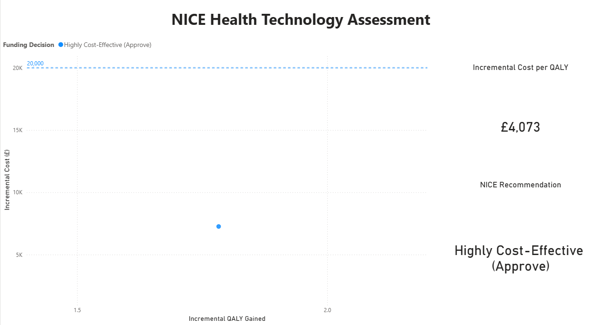

# NICE Health Technology Assessment (HTA) & Cost-Effectiveness Engine

## 📌 Executive Summary
This project replicates the decision-making matrix used by the National Institute for Health and Care Excellence (NICE) to determine whether a new clinical intervention provides enough value to justify funding by the NHS. By analyzing the incremental costs versus the health gains—specifically the Quality-Adjusted Life Year (QALY)—this dashboard identifies whether a new treatment meets the established "willingness-to-pay" threshold.

## 🛠️ Technical Toolkit
* **Database Engine:** Google BigQuery (Standard SQL)
* **Visualization:** Microsoft Power BI
* **Key Analytical Concepts:** Quality-Adjusted Life Years (QALY), Incremental Cost-Effectiveness Ratio (ICER).

## 📊 Business Logic Implemented
* **Data Integration:** Aggregated clinical, procedural, and management cost data from `NICE_Cost_Effectiveness_Data.csv` into a unified analytical view using the logic in `hta_icer_calculation.sql`.
* **Clinical Valuation:** Quantified health outcomes by calculating QALYs, which serve as the primary metric for NICE economic evaluations.
* **Automated Decisioning:** Implemented SQL logic to categorize treatment pathways as 'Highly Cost-Effective', 'Review Required', or 'Rejected' based on the standard £20,000 per QALY threshold.
* **Executive Visualization:** Designed a cost-effectiveness scatter plot that maps intervention performance against national efficiency benchmarks to facilitate rapid, evidence-based decision-making.

## 📈 Key Findings
* The new clinical intervention achieves a superior health outcome with a total ICER of **£4,073 per QALY**.
* Because this ratio falls significantly below the £20,000 threshold, the analysis provides a clear business case for funding approval and national implementation.
